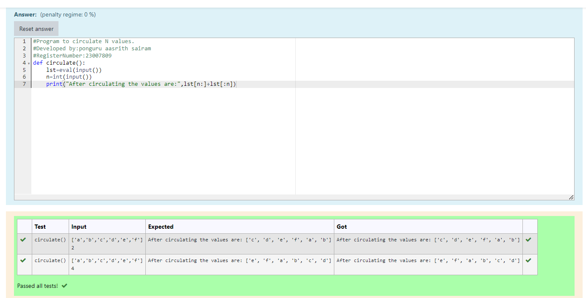

# Circulate-the-values-of-N-variables
## Aim:
To write a python program to circulate the n variables using function concept
## Equipment’s required:
PC
Anaconda - Python 3.7
## Algorithm: 
### Step 1:
Define a function called circulate().
### Step 2: 
Create a identifier to take list from the user to circulate the list by using circulate() function.
### Step 3: 
Get the value from the user for the number of rotation.
### Step 4: 
Using the slicing concept rotate the list.
### Step 5: 
After slicing, print the circulated values.

## Program:
```
#Program to circulate N values.
#Developed by:ponguru aasrith sairam
#RegisterNumber:23007809
def circulate():
    lst=eval(input())
    n=int(input())
    print("After circulating the values are:",lst[n:]+lst[:n])
```

## Output:


## Result:
Thus the circulating of values of N variables is successfully executed.
